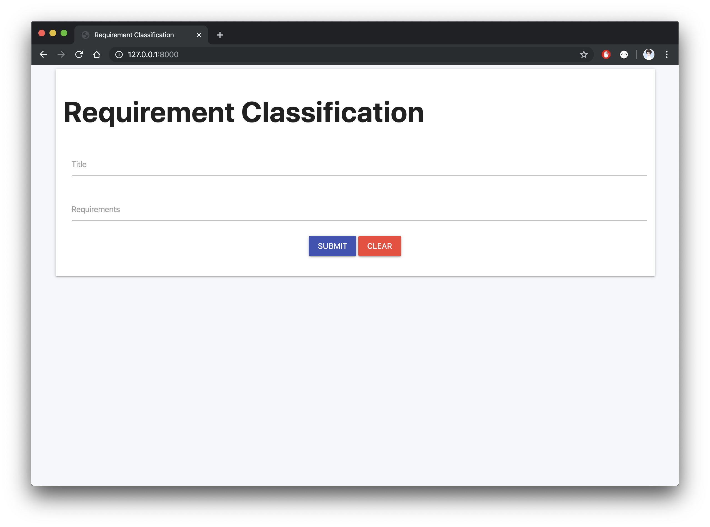
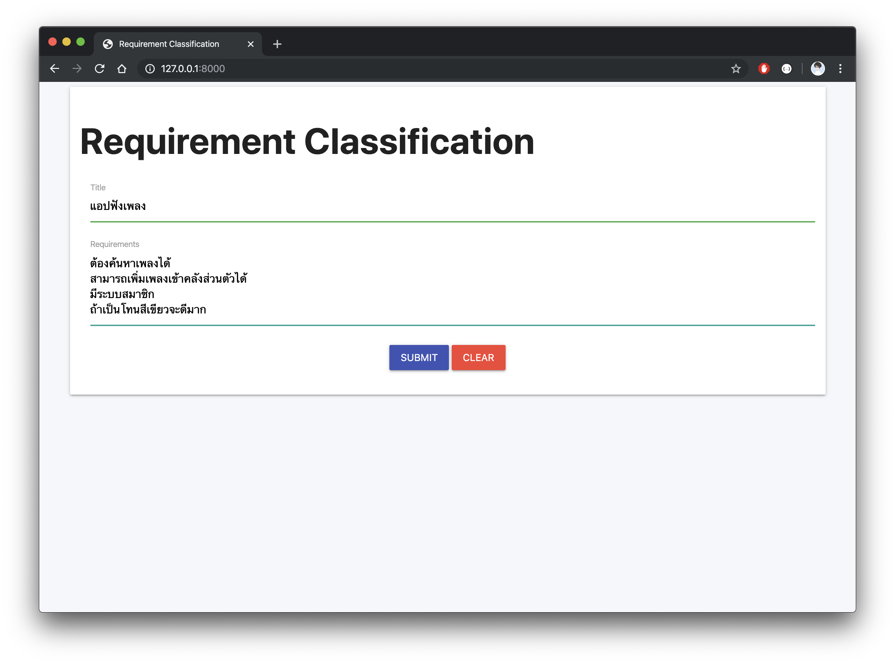
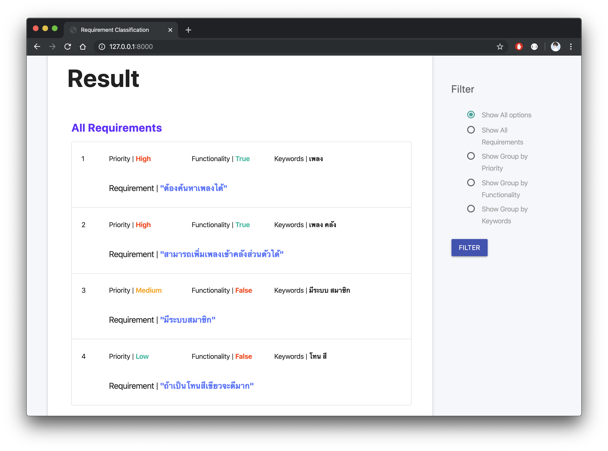
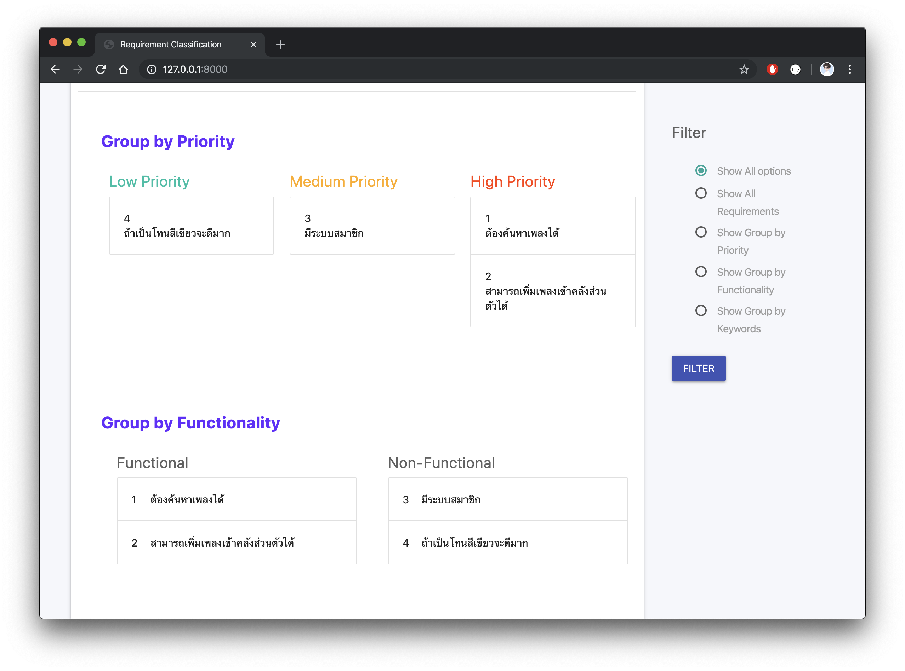
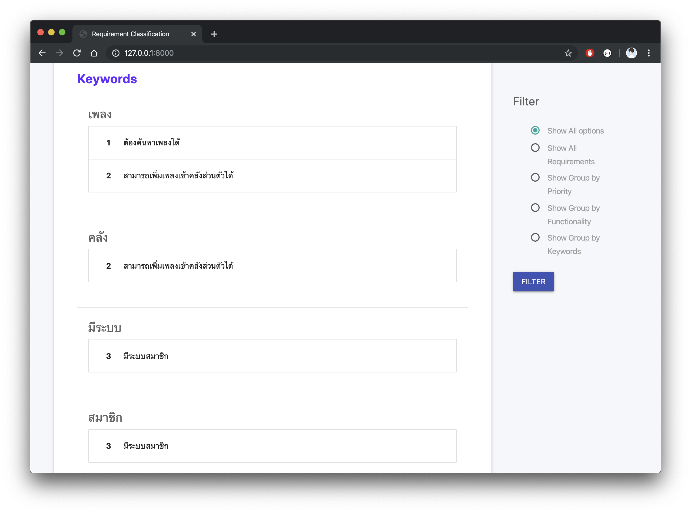

# Requirement Classification
Requirement Classification project of Requirement Engineering class, Faculty of Information Technology, King Mongkut's Institute of Technology Ladkrabang.

## Screenshots

## Team

||||||
|:---:|:---:|:---:|:---:|:---:|
|[810Teams](https://github.com/810Teams)|[ttaitana](https://github.com/ttaitana)|[NaponTunglukmongkol](https://github.com/NaponTunglukmongkol)|[yakung](https://github.com/yakung)|[Sullvo1148](https://github.com/Sullvo1148)|
|Teerapat Kraisrisirikul|Taitana Yumee|Napon Tunglukmongkol|Kazuya Komatsu|Chaiyapong Nithipeerawat|

